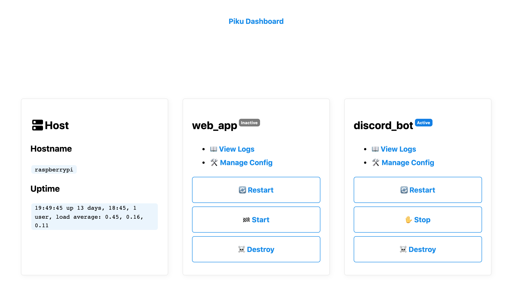

# Piku Dashboard



Piku dashboard is a management interface for apps running in [piku](https://github.com/piku/piku). It is itself an 
application that runs inside of piku (so meta!).

Piku dashboard handles most runtime viewing and management concerns:
* Viewing Host information 
* Viewing Logs
* Viewing and managing Config values
* Managing Application lifecycle (Starting, Stopping, Restarting)
* (WIP) Managing worker scaling 
* Destroying applications

Piku Dashboard tries to delegate to the `~/piku.py` script whereever possible, to avoid re-implementing behaviour
present in the original script (and subsequently create hidden dependencies.). 

Structurally, it is a python/flask web app with basic authentication.

## Quick start
1. pull this repo, and deploy to your piku instance using git:
```sh
git remote add piku piku@mypikuinstance.com:piku_dashboard
git push piku master
```
2. Set config keys for session management and basic authentication:
```sh
# shown here using the piku operator helper
piku config:set SECRET_KEY=abcdef123456790 USERNAME=bob PASSWORD=asdfghjkl0

# You can set other settings, like port number, etc, as you would with any piku app
```
3. Navigate to the hosted piku_dashboard and start managing your apps. 
   The default port is listed in the `ENV` file.
